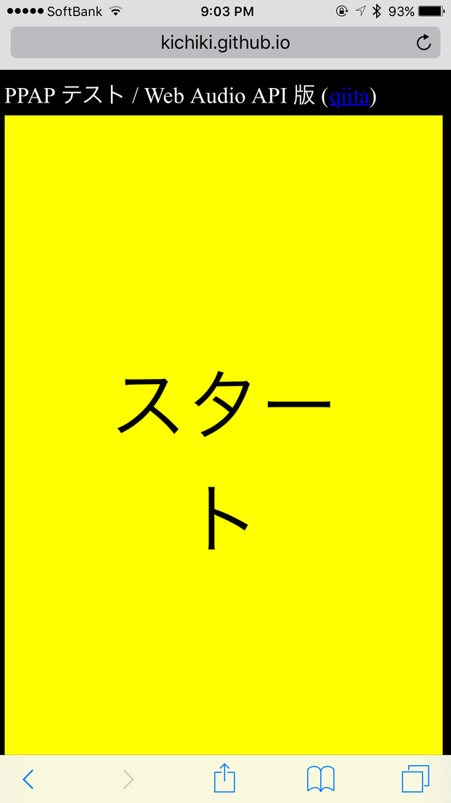
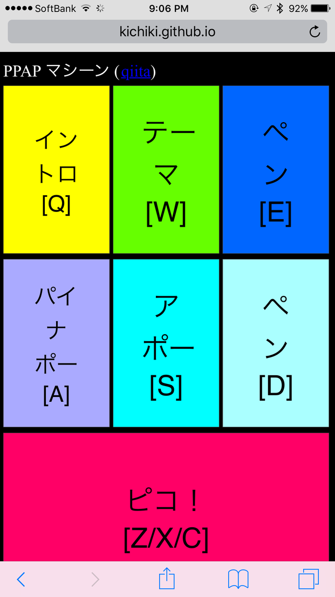

# PPAP-Test

This is an implementation of "PPAP-Test" in JavaScript with Web Audio API (and Video tag).

The background story about "PPAP-Test" is here: [Programmers, Do You Know “PPAP Test”?](https://medium.com/@ichiki_k/do-you-know-ppap-test-8dc9a8a98da)

Detailed description about the code is given at Qiita site (in Japanese): [PPAPテストを Web Audio API で](http://qiita.com/kichiki/items/c0b760375fd9cdcd9065)

## PPAP-Test by Web Audio API

Once you tap the start button (actually the entire screen), PPAP-Test begins until "Pen"-"Pineapple"-"Apple"-"Pen sequence appears.

* [demo](http://kichiki.github.io/misc/ppap/ppap-test.html).

## PPAP Machine by Web Audio API

You can play sound samples taken from PPAP video by tapping 7 buttons on the screen or keys (QWE/ASD/ZXC).

* [demo](http://kichiki.github.io/misc/ppap/ppap-machine.html).

## PPAP implementation with Video tag

This project is my first attempt for PPAP-Test implementation but it's not working as expected.

The approach is simply to seek and play the single video.

The seek is done by setting `currentTime` and the code seems to work properly at least on Chrome.

The problem is on Safari (both iOS and Mac); There is a delay just after setting `currentTime`, so that PPAP sound is not audible.

* [demo](http://kichiki.github.io/misc/ppap/ppap-video.html).

# Credits

The video is taken from YouTube

* [PPAP official video](https://www.youtube.com/watch?v=0E00Zuayv9Q)
* [PPAP dance by Rika-Riko](https://www.youtube.com/watch?v=beWvQFcZ_Ig)
